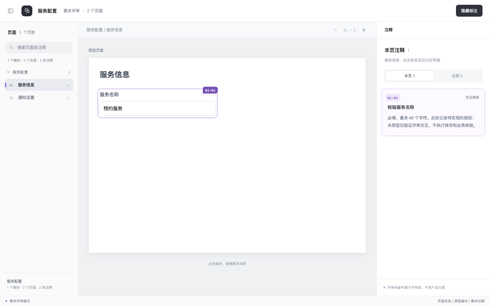

# 使用与维护指南

`requirement-review-wireframe` 把产品原型与评审说明分开：评审者通过编号查看规则，也可以隐藏标注查看产品本身。单页自动省略目录；多页使用可搜索的目录，并支持跨页定位。

## 安装与首次使用

下载或克隆仓库后，将整个 `skills/product/requirement-review-wireframe/` 复制到 Codex 的 skills 目录中，不要只复制 `SKILL.md`。默认目标为 `~/.codex/skills/requirement-review-wireframe/`；设置了 `CODEX_HOME` 时使用 `$CODEX_HOME/skills/requirement-review-wireframe/`。

安装后应能看到 `SKILL.md`、`agents/`、`assets/`、`scripts/` 和 `references/`。如果已有同名目录，先把旧目录备份到仓库之外，再用完整的新目录替换，避免遗留已删除的资源。

准备需求规则、页面范围和可用的源码／截图。需求已有编号或文档章节时，一并提供；没有源码时，生成的界面只能依据资料重建，需确认推断部分。

在 Codex 中输入，例如：

```text
使用 $requirement-review-wireframe，制作“服务配置”的两页 HTML 评审原型。
页面一“服务信息”包含服务名称，需求 R1-01：必填，最多 40 个字符。
页面二“通知设置”包含通知邮箱，需求 R2-01：可留空，填写时需要有效邮箱。
没有现有源码，使用简洁灰度表单。展示页面目录、独立标注和隐藏／显示标注。
本轮只验证评审交互，不接业务接口，不实现保存和业务校验。
交付 HTML 和完整资源，列出已验证与未实现的内容。
```

打开交付的 HTML 后，应能切换页面，点击编号与标注双向定位，隐藏标注并再次恢复。交付多文件版本时，保持 HTML 与 CSS/JS 的相对路径；分享时发送整个文件夹。

如果无法调用技能，先核对安装目录和 `SKILL.md` 的 `name` 是否为 `requirement-review-wireframe`，再检查当前 Codex 会话是否已发现该技能。

## 正式示例与效果

仓库提供与上述输入对应的 [服务配置示例](../assets/examples/service-settings.html)，使用虚构内容，没有真实客户数据。下载仓库后可直接用浏览器打开；GitHub 上的 HTML 链接展示源码。



示例引用上一级目录的三个共享资源，没有复制另一套 CSS/JS。若只下载 HTML，资源会缺失；需同时保留 `assets/` 下的共享文件。示例输入仅用于展示，未实现保存、邮件发送或业务校验；切页保留输入，刷新后恢复初始内容。

可以按以下顺序体验：

1. 在“服务信息”中修改服务名称，切到“通知设置”，再返回，确认输入仍在。
2. 点击画布上的 `R1-01`，再点击右侧标注，确认焦点可双向定位。
3. 搜索 `R2-01`，打开匹配的“通知设置”页面；无结果时清空搜索可恢复目录。
4. 切到“全部”注释，展开另一页的注释并点击，确认会打开对应页面。
5. 点击“隐藏标注”，继续切页，再点击“显示标注”，确认可恢复。

## 文件职责

| 文件 | 用途与维护时机 |
| --- | --- |
| `SKILL.md` | 技能入口、数据契约、交互边界和交付要求；规则变化时更新 |
| `agents/openai.yaml` | 显示名称、简介和默认调用语；能力或名称变化时同步 |
| `assets/wireframe-template.html` | 生成交付物的起点；保留占位符，实际交付时替换 |
| `assets/requirement-review.css` | 评审层样式；保留 `req-` 隔离，避免影响产品样式 |
| `assets/requirement-review.js` | 隐藏／显示、编号定位、异步弹层目标接入 |
| `assets/requirement-workspace.js` | 页面挂载、目录搜索、跨页标注与切页状态 |
| `assets/examples/` | 可运行示例与对应截图；共享布局或接入方式变化后复查 |
| `scripts/check-interactions.cjs` | 共享工作台的浏览器交互回归检查 |

实际生成从 `wireframe-template.html` 开始；正式示例仅演示接入方式，不把示例字段、页数或规则带入其他业务。

## 维护与验证

浏览交付物只需要启用 JavaScript 的现代浏览器，无需 Node.js 或 Python。维护仓库的目录校验需要 Python 3；运行交互回归需要 Node.js、npm、Playwright 和对应的 Chromium。

以下准备步骤适用于 macOS／Linux 的 bash 或 zsh，在仓库根目录执行。依赖放在临时目录，避免向仓库加入包清单或依赖目录；同一终端内依次执行：

```sh
node --version
npm --version
python3 --version
review_check_dir="$(mktemp -d)"
npm install --prefix "$review_check_dir" --no-audit --no-fund playwright@1.62.1
node "$review_check_dir/node_modules/playwright/cli.js" install chromium
NODE_PATH="$review_check_dir/node_modules" node skills/product/requirement-review-wireframe/scripts/check-interactions.cjs
python3 scripts/check_layout.py
```

Playwright 版本固定为此次验证版本；安装库后还需下载匹配的浏览器，参见 [Playwright 官方库使用说明](https://playwright.dev/docs/library)。Linux 若提示缺少浏览器系统依赖，按官方 [浏览器依赖说明](https://playwright.dev/docs/browsers#install-system-dependencies) 准备运行环境。有预装 Playwright 的环境可将 `NODE_PATH` 指向其包目录，复用匹配的 Chromium。

交互回归成功时输出 6 条 `PASS`，退出码为 0，覆盖单页、3 页、24 页、隐藏恢复、焦点往返、输入保留、搜索、跨页定位、异步目标，以及 1100／800／375 像素宽度。它使用测试页面，不会自动验证正式示例或所有实际业务弹窗。

修改共享资源或正式示例后，还需打开正式示例和受影响的实际交付物，在桌面、1100 px 和 375 px 宽度检查上述体验步骤、文字可读性、编号遮挡和横向溢出。有真实弹窗时另外验证 Escape、焦点限制与关闭后焦点返回。

示例外观变化时，先验证交互，再从实际 HTML 更新 `assets/examples/service-settings.png`，保持截图与当前示例一致。当前截图采用 1440 × 900 视口、默认首页和显示标注状态。临时排查截图不加入发布目录。

## 更新、发布与反馈

- 在原目录修改；新增／移动 skill 时同步根 README 的目录，改变使用方式或示例效果时同步相关说明。
- 检查本次文件差异，按明确路径暂存新增文件；提交前运行 `python3 scripts/check_layout.py` 和所需专项验证。目录检查基于已跟踪／已暂存的路径，未暂存的新文件不会被纳入。GitHub 当前目录检查不能代替浏览器交互验证。
- 提交或发布说明写清改动、使用者影响、验证结果及未验证项。没有运行的检查不要标为通过。
- 更新安装目录不会更新以前交付的 HTML。旧交付物需要单独同步评审资源；单文件版本需要重新内联。保持需求编号稳定，再验证受影响页面。
- 如调整页面配置字段、脚本加载顺序或资源路径，需说明旧配置如何迁移，并同步模板、示例与测试。

反馈问题时，可在仓库 Issues 可用时提交：使用的提交版本、浏览器及窗口宽度、最小复现步骤、预期与实际结果，以及去除隐私的截图或示例。无 Issues 时，将同样信息交给维护者。
